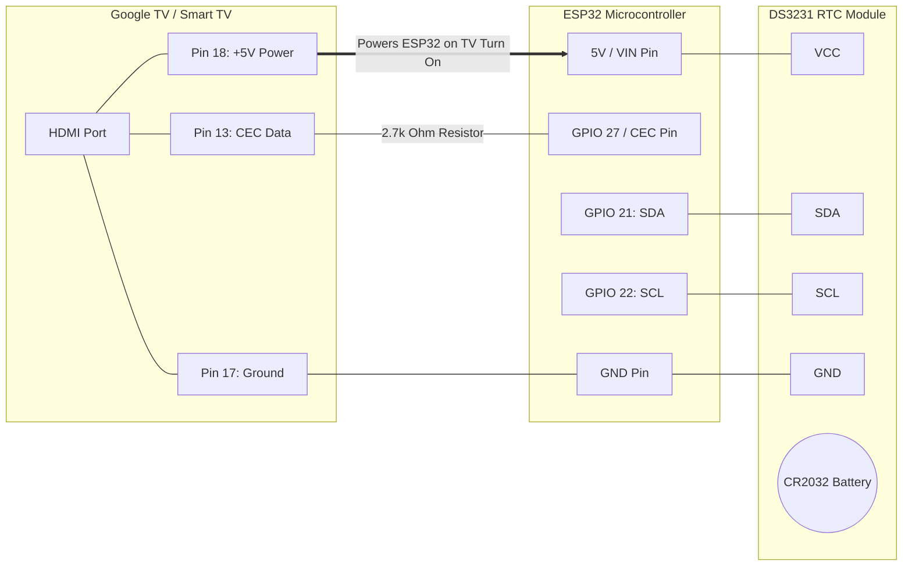

# Project Architecture & Workflow Blueprint (مخطط المشروع)

This document provides a visual blueprint of how the **ESP32 HDMI-CEC TV Autostart** project works, both on the hardware level and the software logic level.
يوضح هذا المستند مخططاً مرئياً لآلية عمل المشروع (هاردوير وسوفتوير).

## 1. Hardware Connections (توصيلات الهاردوير)



## 2. Software Logic Workflow (مخطط عمل السوفتوير)

```mermaid
flowchart TD
    Start((Power Restored / TV ON)) --> Init[Initialize Serial & I2C]
    Init --> ReadRTC[Read Current Time from DS3231 RTC]
    
    ReadRTC --> CheckLastTime{Is Last Power-On\nTime Saved in RTC?}
    
    CheckLastTime -- No --> SaveCurrent[Save Current Time to RTC Memory]
    CheckLastTime -- Yes --> CalcDiff[Calculate Outage Duration\n(Current Time - Last Time)]
    
    CalcDiff --> CheckDuration{Is Duration > 60 seconds?}
    CheckDuration -- No (Brief outage/Restart) --> WaitShort[Wait 30 Seconds]
    CheckDuration -- Yes (Long power cut) --> WaitLong[Wait 60 Seconds]
    
    WaitShort --> CEC_Init[Initialize HDMI-CEC Protocol]
    WaitLong --> CEC_Init
    
    CEC_Init --> CEC_Send[Send CEC Command:\n<Image View On> & <Active Source>]
    CEC_Send --> DelayApp[Wait 15 Seconds for TV to Boot]
    
    DelayApp --> SendApp[Send Android TV Keycodes/Intents via CEC\nTo Launch Specific App]
    SendApp --> SaveNewTime[Save Current Time to RTC\nas new Last Power-On Time]
    SaveNewTime --> DeepSleep[Enter Deep Sleep / Idle]
```

## 3. Supported Microcontrollers (المتحكمات المدعومة)

This project currently supports the following microcontrollers natively through the flashing tool:
يدعم المشروع حالياً المتحكمات التالية، ويمكن برمجتها بضغطة زر عبر أداة `حرق_السوفتوير.bat`:

1. **ESP32 WROOM (DevKit v1)**: The standard and most common ESP32 board.
2. **ESP32-C3 Super Mini**: A very small and compact ESP32 board, ideal for hiding behind the TV.
