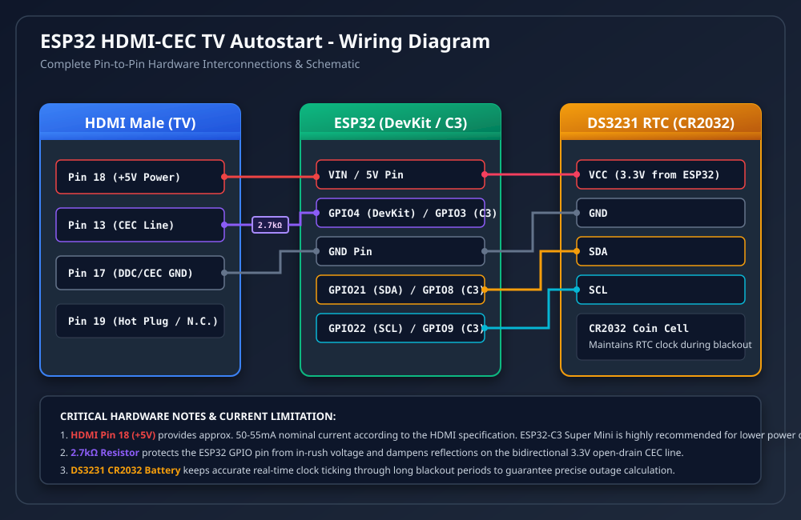

# 📺 تشغيل التلفزيون تلقائياً بعد عودة الكهرباء عبر منفذ HDMI
### ESP32 HDMI-CEC TV Autostart

<div align="center">

[](LICENSE)
[](https://github.com/HAY2023/tv-power-restore/actions/workflows/build.yml)
[](#-قائمة-المكونات-والقطع-المطلوبة-bom)
[](#-الطريقة-الأولى-البرمجة-المباشرة-عبر-المتصفح-الأسهل-بدون-برامج-أو-أكواد)

**جهاز صغير ومستقل يتم تركيبه في منفذ HDMI لتشغيل شاشات Google TV والشاشات الذكية تلقائياً بعد عودة التيار الكهربائي المنقطع، واختيار منفذ الدخل فوراً — بدون الحاجة لشبكة واي فاي وبدون أي تدخل يدوي.**

[الدليل العربي الكامل](#-الدليل-العربي-الشامل) • [English Summary (For Developers)](#-english-summary-for-developers)

</div>

---

# 🇸🇦 الدليل العربي الشامل

## 💡 فكرة المشروع والهدف منه

عند انقطاع التيار الكهربائي وعودته، تدخل معظم شاشات التلفزيون الذكية الحديثة (مثل **Google TV**, **Android TV**, **سامسونج**, **LG**, **سوني**) تلقائياً في **وضع الاستعداد (Standby)** وتبقى الشاشة مطفأة ولا تعمل إلا بالضغط يدوياً على زر التشغيل في جهاز التحكم (الريموت).

يقوم هذا المشروع بحل هذه المشكلة جذرياً وبشكل آلي تماماً:
1. **جهاز مستقل تماماً**: يتم توصيله مباشرة بأحد منافذ الـ HDMI في الشاشة.
2. **يعمل بدون إنترنت**: لا يعتمد على الواي فاي، ولا يحتاج إلى تطبيقات أو خوادم سحابية.
3. **يستمد طاقته من منفذ الـ HDMI**: عبر السن رقم 18 (جهد 5 فولت) والسن رقم 17 (الأرضي).
4. **يحسب مدة انقطاع الكهرباء بدقة**: بفضل موديول التوقيت **DS3231 RTC** المزود ببطارية مدمجة تحتفظ بالوقت حتى أثناء انقطاع التيار.
5. **ينتظر حتى تستقر الشاشة**: ينتظر مهلة زمنية قابلة للتعديل (الافتراضي 15 ثانية) لضمان إقلاع اللوحة الأم للشاشة واستعدادها لاستقبال الأوامر.
6. **يرسل أوامر التحكم عبر HDMI-CEC**:
   - أمر إيقاظ الشاشة من وضع الاستعداد (`<Image View On>`).
   - أمر تفعيل وتوجيه العرض إلى منفذ الـ HDMI الموصول به الجهاز (`<Active Source>`).

---

## 🛒 قائمة المكونات والقطع المطلوبة (BOM)

| المكون | المواصفات والشرح | الكمية | الغرض من القطعة | روابط تقريبية للطلب |
| :--- | :--- | :---: | :--- | :--- |
| **شريحة ESP32 WROOM** *(الأساسية)* | لوحة تطوير ESP32 DevKit v1 (30 سن أو 36 سن) | 1 | عقل الجهاز لتنفيذ بروتوكول CEC وإرسال الأوامر | [AliExpress](https://www.aliexpress.com/wholesale?SearchText=esp32+devkit+v1) / [Amazon](https://www.amazon.com/s?k=esp32+devkit+v1) |
| **موديول ساعة DS3231 RTC** | موديول توقيت دقيق جداً بنظام I2C مزود بذاكرة EEPROM | 1 | الحفاظ على دقة الوقت وتخزين وقت التشغيل السابق | [AliExpress](https://www.aliexpress.com/wholesale?SearchText=DS3231+RTC+module) / [Amazon](https://www.amazon.com/s?k=DS3231+RTC+module) |
| **بطارية قرصية CR2032** | بطارية ليثيوم 3 فولت | 1 | تشغيل شريحة التوقيت أثناء انقطاع الكهرباء | متوفرة في محلات الساعات والمكتبات |
| **قابس ذكر HDMI Breakout** | وصلة HDMI ذكر مزودة بأطراف لحام أو مسامير | 1 | التركيب في منفذ الشاشة لأخذ الطاقة ونقل إشارة CEC | [AliExpress](https://www.aliexpress.com/wholesale?SearchText=HDMI+male+breakout+board) / [Amazon](https://www.amazon.com/s?k=HDMI+male+breakout) |
| **مقاومة كهربائية 2.7kΩ** | مقاومة 2.7 كيلو أوم (1/4 واط) | 1 | حماية طرف الـ ESP32 وضبط إشارة خط الـ CEC | متوفرة في محلات الإلكترونيات |
| **مكثف كيميائي (اختياري وموصى به)** | 100 إلى 220 ميكروفاراد (10V أو 16V) | 1 | تثبيت جهد الـ 5V ومنع هبوط الجهد اللحظي | متوفر في محلات الإلكترونيات |

> [!NOTE]
> **ملاحظة بخصوص الشريحة:** تم ضبط المشروع افتراضياً ليعمل على شريحة **ESP32 WROOM (DevKit v1)** الأكثر انتشاراً وتوفراً. كما يدعم الكود أيضاً شريحة **ESP32-C3 Super Mini** لمن يفضل حجماً أصغر واستهلاك طاقة أقل.

---

## 🔌 مخطط التوصيل والأسلاك



### 1. جدول توصيل منفذ الـ HDMI مع شريحة ESP32 WROOM (الافتراضية)

| رقم سن الـ HDMI | اسم الإشارة | الطرف المقابل في ESP32 WROOM | الشرح والملاحظات |
| :---: | :---: | :---: | :--- |
| **السن 18** | **+5V Power** | طرف **`VIN`** (أو `5V`) | لتغذية لوحة الـ ESP32 بالكهرباء مباشرة من الشاشة |
| **السن 17** | **GND** | طرف **`GND`** | الخط الأرضي المشترك |
| **السن 13** | **CEC** | طرف **`GPIO 4`** *(عبر المقاومة 2.7kΩ)* | خط إرسال أوامر التحكم للشاشة |

### 2. جدول توصيل موديول الساعة DS3231 مع شريحة ESP32 WROOM

| طرف موديول DS3231 | طرف ESP32 WROOM | الشرح |
| :---: | :---: | :--- |
| **VCC** | **`3.3V`** | التغذية الكهربائية للموديول (3.3 فولت) |
| **GND** | **`GND`** | الخط الأرضي |
| **SDA** | **`GPIO 21`** | خط نقل بيانات الوقت (I2C Data) |
| **SCL** | **`GPIO 22`** | خط نبضات التزامن (I2C Clock) |

> [!IMPORTANT]
> **طريقة تركيب المقاومة 2.7kΩ:** يتم لحام أحد طرفي المقاومة بالسن رقم 13 في موصل الـ HDMI، والطرف الآخر للمقاومة يُربط بسلك يتجه إلى الطرف `GPIO 4` في لوحة الـ ESP32.

---

## 🚀 تحميل ملفات السوفتوير الجاهزة (Releases)

لا تحتاج لكتابة أي كود أو تنزيل برامج برمجة معقدة! يقوم النظام تلقائياً بإنشاء ملفات السوفتوير الجاهزة للرفع بصيغة `.bin`:

| اللوحة | ملف الفلاش المدمج الشامل (موصى به) | ملف السوفتوير الفردي |
| :--- | :--- | :--- |
| **ESP32 WROOM (DevKit v1)** *(الأساسية)* | [`esp32-wroom-complete-flash-offset-0x0.bin`](https://github.com/HAY2023/tv-power-restore/releases) *(يُحرق عند العنوان `0x0`)* | [`esp32-wroom-firmware.bin`](https://github.com/HAY2023/tv-power-restore/releases) *(يُحرق عند العنوان `0x10000`)* |
| **ESP32-C3 Super Mini** *(الاختيارية)* | [`esp32-c3-complete-flash-offset-0x0.bin`](https://github.com/HAY2023/tv-power-restore/releases) *(يُحرق عند العنوان `0x0`)* | [`esp32-c3-firmware.bin`](https://github.com/HAY2023/tv-power-restore/releases) *(يُحرق عند العنوان `0x10000`)* |

---

## ⚡ طرق برمجة الشريحة (خطوة بخطوة للمبتدئين)

### 🌟 الطريقة الأولى: البرمجة المباشرة عبر المتصفح (بدون برامج أو أكواد)

هذه هي أسهل وأسرع طريقة لا تتطلب تثبيت أي برامج أو فتح سطر الأوامر:

1. صِل شريحة الـ ESP32 بجهاز الكمبيوتر باستخدام **كابل USB لنقل البيانات** (تأكد أنه ليس كابل شحن فقط).
2. افتح متصفح **Google Chrome** أو **Microsoft Edge** أو **Brave** على جهازك.
3. توجه إلى أحد مواقع حرق السوفتوير المعتمدة:
   - [موقع Adafruit WebSerial ESPTool](https://adafruit.github.io/Adafruit_WebSerial_ESPTool/) أو
   - [موقع ESP Web Tools](https://esphome.github.io/esp-web-tools/)
4. اضغط على زر **Connect** ستظهر لك نافذة منبثقة، اختر منها منفذ الـ COM الخاص بالشريحة ثم اضغط **Connect**.
5. اختر ملف الفلاش المدمج الذي قمت بتحميله: `esp32-wroom-complete-flash-offset-0x0.bin`.
6. تأكد من ضبط خانة العنوان (Offset) على: `0x0` (أو `0x0000`).
7. اضغط على زر **Program** أو **Flash** وانتظر حتى يصل الشريط إلى 100%.
8. **مبروك!** تمت برمجة القطعة بنجاح، يمكنك الآن فصلها وتركيبها في التلفزيون.

---

### 🖥️ الطريقة الثانية: أداة ويندوز السريعة بنقرة واحدة (ملف `.bat` التفاعلي)

إذا كنت تستخدم نظام ويندوز، يمكنك برمجة الشريحة بضغطة زر واحدة بدون أي خطوات معقدة:

1. صِل شريحة الـ ESP32 بالكمبيوتر عبر كابل USB.
2. اضغط مرتين (Double Click) على الملف المباشر في المجلد الرئيسي:
   👉 **[`حرق_السوفتوير.bat`](file:///h:/tv-power-restore/حرق_السوفتوير.bat)** (أو `flash.bat`).
3. ستقوم الأداة تلقائياً بما يلي:
   - **اكتشاف منفذ الـ COM للشريحة تلقائياً**.
   - إعطاؤك قائمة تفاعلية لاختيار الشريحة (`ESP32 WROOM` أو `ESP32-C3`).
   - حرق السوفتوير مع إعادة المحاولة الذكية بالسرعة المستقرة إذا حدث أي انقطاع.
   - خيار إضافي لمسح ذاكرة الشريحة بالكامل (Full Chip Erase).

---

### 💻 الطريقة الثالثة: البرمجة عبر موجه الأوامر باستخدام أداة `esptool.py`

إذا كنت تفضل استخدام موجه الأوامر:

#### الخطوة 1: تثبيت أداة esptool
تأكد من وجود [برنامج بايثون Python](https://www.python.org/) على جهازك، ثم افتح موجه الأوامر (Command Prompt أو PowerShell أو Terminal) واكتب:
```bash
pip install esptool
```

#### الخطوة 2: معرفة رقم منفذ الشريحة (COM Port)
- **على نظام ويندوز (Windows)**:
  - اضغط بالزر الأيمن على زر ابدأ واختر **Device Manager** (إدارة الأجهزة).
  - افتح قسم **Ports (COM & LPT)** ستجد اسم المنفذ بين قوسين (مثلاً: `COM3` أو `COM4`).
- **على نظام ماك (macOS)**:
  - اكتب في التيرمينال: `ls /dev/cu.usbserial*`
- **على نظام لينكس (Linux)**:
  - اكتب في التيرمينال: `ls /dev/ttyUSB*`

#### الخطوة 3: أمر الحرق المباشر
استبدل `COM3` برقم المنفذ الخاص بك:

- **أمر حرق الملف المدمج الشامل (موصى به عند العنوان `0x0`)**:
  ```bash
  esptool.py --chip esp32 --port COM3 --baud 460800 write_flash 0x0 esp32-wroom-complete-flash-offset-0x0.bin
  ```

- **أمر حرق السوفتوير فقط عند العنوان `0x10000`**:
  ```bash
  esptool.py --chip esp32 --port COM3 --baud 460800 write_flash 0x10000 esp32-wroom-firmware.bin
  ```

> [!TIP]
> **نصائح هامة عند البرمجة:**
> - إذا ظهرت رسالة `A fatal error occurred: Failed to connect`: اضغط باستمرار على زر **BOOT** الموجود على شريحة الـ ESP32 أثناء تنفيذ الأمر وافلت الزر عند بدء التحميل.
> - إذا انقطع التحميل في المنتصف، جرب تقليل السرعة إلى `115200`:
>   `esptool.py --chip esp32 --port COM3 --baud 115200 write_flash 0x0 esp32-wroom-complete-flash-offset-0x0.bin`
> - إذا لم يظهر منفذ الـ COM في إدارة الأجهزة، قم بتثبيت تعريف [شريحة CH340](https://sparks.gogo.co.nz/ch340.html) أو [شريحة CP2102](https://www.silabs.com/developers/usb-to-uart-bridge-vcp-drivers).

---

### 🛠️ الطريقة الثالثة: البناء والتعديل للمطورين عبر PlatformIO

إذا كنت ترغب في تعديل الكود بنفسك:
1. قم باستنساخ المشروع:
   ```bash
   git clone https://github.com/HAY2023/tv-power-restore.git
   cd esp32-hdmi-cec-tv-autostart
   ```
2. افتح المجلد داخل برنامج VS Code مع إضافة PlatformIO.
3. لبناء السوفتوير ورفعه مباشرة لشريحة ESP32 WROOM:
   ```bash
   pio run -e esp32dev -t upload
   ```
4. لتوليد ملف الـ `.bin` محلياً:
   ```bash
   pio run -e esp32dev
   ```
   ستجد الملف المترجم في المسار: `.pio/build/esp32dev/firmware.bin`.

---

## 🔧 دليل حل المشاكل الشائعة (Troubleshooting)

### 1. الشاشة لا تعمل تلقائياً بعد عودة الكهرباء
- **تأكد من تفعيل خاصية HDMI-CEC في إعدادات الشاشة**: تختلف التسمية التجارية للخاصية حسب ماركة الشاشة:
  - **شاشات Google TV و Android TV**: *الإعدادات ← الشاشة والصوت ← HDMI-CEC ← تفعيل التحكم في الأجهزة والتشغيل التلقائي*.
  - **شاشات سامسونج (Samsung)**: *الإعدادات ← عام ← إدارة الأجهزة الخارجية ← تفعيل Anynet+ (HDMI-CEC)*.
  - **شاشات إل جي (LG)**: *الإعدادات ← عام ← الأجهزة ← إعدادات HDMI ← تفعيل SIMPLINK (HDMI-CEC)*.
  - **شاشات سوني (Sony)**: *الإعدادات ← مشاهدة التلفزيون ← المدخلات الخارجية ← إعدادات BRAVIA Sync*.
- **زيادة مهلة الانتظار (`WAIT_SECONDS`)**: بعض الشاشات تستغرق وقتاً أطول حتى يكتمل إقلاع اللوحة الأم؛ جرب زيادة القيمة في ملف `include/config.h` من 15 إلى 20 أو 25 ثانية.
- **تحديد منفذ الـ HDMI الصحيح**: افتراضياً، الكود يرسل الأمر للمنفذ رقم 1 (`0x1000`). إذا ركبت الجهاز في منفذ HDMI 2، يمكنك تعديل العنوان في ملف `config.h` إلى `0x2000` (المنفذ 3 هو `0x3000`).

### 2. موديول الساعة DS3231 يفقد التوقيت
- **فحص البطارية القرصية CR2032**: تأكد من أن قياس جهد البطارية لا يقل عن 2.9 إلى 3.2 فولت.
- **تعديل دائرة الشحن في موديول ZS-042**: تحتوي بعض موديولات DS3231 الزرقاء التجارية على دائرة شحن مخصصة لبطاريات LIR2032 القابلة للشحن، والتي قد تتلف بطاريات CR2032 العادية؛ يُنصح بإزالة المقاومة 200Ω أو الدايود (المحدد بـ `D1` أو `R5`) لإلغاء الشحن عند استخدام بطارية عادية.

### 3. استقرار التغذية الكهربائية لمنفذ HDMI
- تنص مواصفات HDMI على توفير 55 مللي أمبير كحد أدنى على السن رقم 18.
- يُنصح بلحام مكثف تنعيم (100µF إلى 220µF) بين خطي `5V` و `GND` لامتصاص أي هبوط لحظي في الجهد أثناء بث الإشارة.
- إذا كانت الشاشة تقطع الطاقة تماماً عن منافذ HDMI أثناء وضع الاستعداد، يمكنك تغذية شريحة الـ ESP32 من منفذ USB قريب في الشاشة (5V و GND) مع إبقاء خط الـ CEC (السن 13) والأرضي (السن 17) متصلين بمنفذ الـ HDMI.

---

# 🇬🇧 English Summary (For Developers)

### Overview
This project turns on Google TV / Smart TVs and activates the HDMI source automatically via **HDMI-CEC** following an electrical outage, without requiring WiFi, clouds, or remote controls.

- **Primary Target Board**: **ESP32 WROOM (DevKit v1)** (Default).
- **Secondary/Optional Target**: **ESP32-C3 Super Mini**.
- **Power Source**: Directly from HDMI Pin 18 (+5V) & Pin 17 (GND).
- **CEC Line**: Connected through a 2.7kΩ series resistor to `GPIO 4` (WROOM) / `GPIO 3` (C3).
- **RTC Storage**: DS3231 module via I2C (`GPIO 21` SDA, `GPIO 22` SCL) with AT24C32 EEPROM / NVS timestamp logging.

### Precompiled Binary Releases
Precompiled `.bin` files and merged flash images are generated automatically by GitHub Actions on every commit:
- [`esp32-wroom-complete-flash-offset-0x0.bin`](https://github.com/HAY2023/tv-power-restore/releases) (Flash at `0x0`)
- [`esp32-wroom-firmware.bin`](https://github.com/HAY2023/tv-power-restore/releases) (Flash at `0x10000`)

### 1-Click Windows Flasher (.bat)
Simply double-click **[`flash.bat`](file:///h:/tv-power-restore/flash.bat)** (or `حرق_السوفتوير.bat`) in the root directory to auto-detect your COM port and flash your ESP32 board interactively!

### Quick Flash (Terminal)
```bash
# Install esptool
pip install esptool

# Flash complete merged binary
esptool.py --chip esp32 --port COM3 --baud 460800 write_flash 0x0 esp32-wroom-complete-flash-offset-0x0.bin
```

---

## 📄 License
This project is open-source and licensed under the [MIT License](LICENSE).
